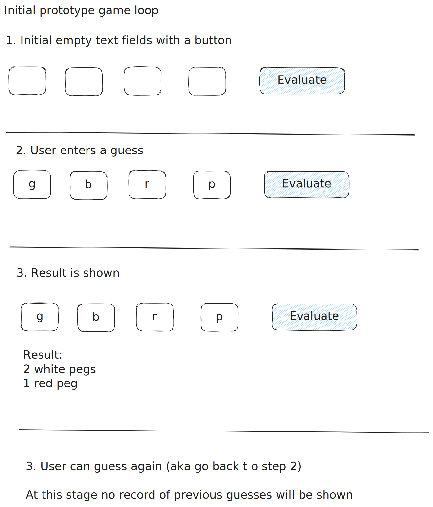

# Prototype 1

The initial goal is to create a simple UI with game logic to evaluate a guess.

The user will be shown text fields where they can enter a letters to choose colors. They can then submit this and the app will evaluate the guess. They can then guess again by changing the values in the text fields. 

## Rules of the game

Mastermind rules can be found [here](https://en.wikipedia.org/wiki/Mastermind_(board_game)).

## Keys

In this version the user will type letters to represent colors. 

Code pegs
- r - red
- b - blue
- p - purple
- g - green 

Key pegs 
- r - red
- w - white

As per the rules, a colored key peg is placed for each code peg from the guess which is correct in both color and position. 

A white key peg indicates a code peg that belongs in the solution but is incorrectly positioned.

## Sketch of the UI

For this version the UI should look similar to this:

